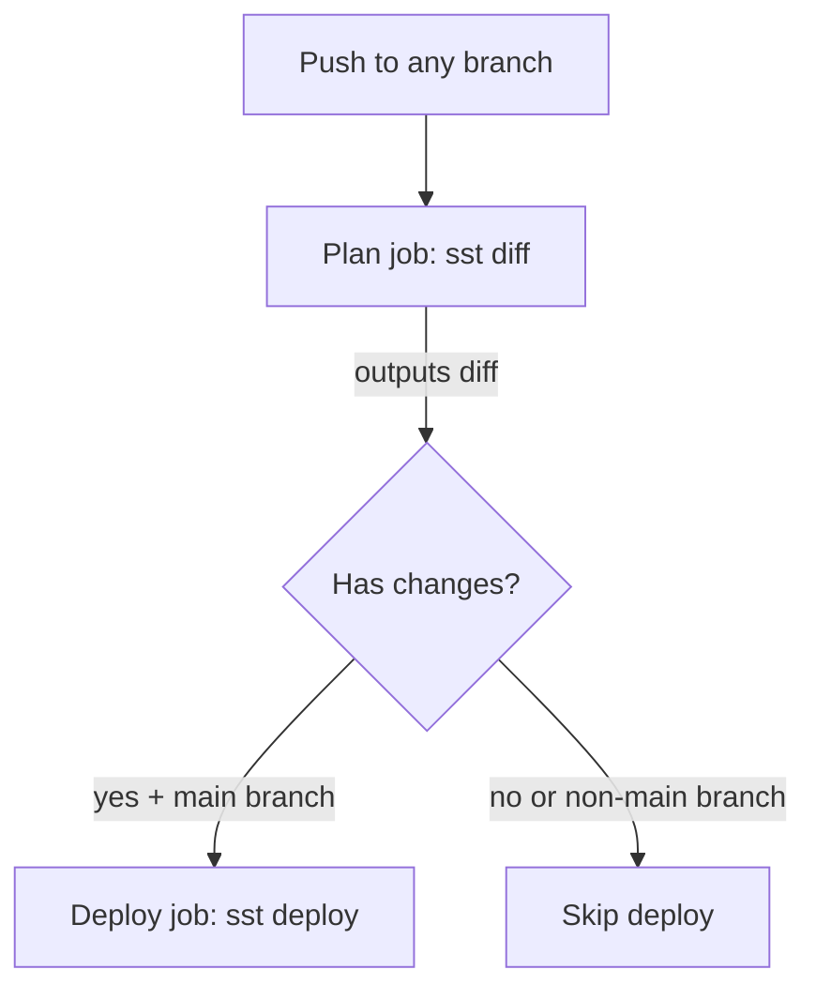

# Deploy Supabase Database via SST from GitHub Actions

All infrastructure code lives in the `infra/` directory, fully isolated from the application code.

## Architecture



## 1. Create `infra/package.json`

A dedicated package.json for the infra directory with `sst` as its only dependency. The root `package.json` stays untouched.

```json
{
  "name": "scoring-analyzer-infra",
  "private": true,
  "type": "module",
  "dependencies": {
    "sst": "latest"
  }
}
```

Note: `"type": "module"` is required by SST v3 for ESM config loading.

## 2. Create `infra/sst.config.ts`

```ts
/// <reference path="./.sst/platform/config.d.ts" />
export default $config({
  app(input) {
    return {
      name: "scoring-analyzer",
      home: "cloudflare",
      providers: {
        supabase: "1.7.0",
      },
    };
  },
  async run() {
    const project = new supabase.Project("ScoringAnalyzer", {
      organizationId: process.env.SUPABASE_ORG_ID!,
      name: "scoring-analyzer",
      databasePassword: process.env.SUPABASE_DB_PASSWORD!,
      region: "eu-central-1",
      instanceSize: "micro",
    });
    return { projectId: project.id };
  },
});
```

Key details:

- `instanceSize: "micro"` is the free-tier instance size
- Secrets (`SUPABASE_ORG_ID`, `SUPABASE_DB_PASSWORD`) come from environment variables
- The Supabase provider authenticates via the `SUPABASE_ACCESS_TOKEN` env var automatically

## 3. Create GitHub Actions workflow

Create [.github/workflows/deploy-infra.yml](.github/workflows/deploy-infra.yml) with two jobs: **plan** and **deploy**.

- Triggers on pushes to any branch and on `workflow_dispatch`.
- The **plan** job always runs `sst diff` and prints the output.
- The **deploy** job only runs when: (a) the branch is `main`, AND (b) `sst diff` reported changes.

SST's `sst diff` exits with code 0 whether or not there are changes, so we capture its output and check for the string "No changes" to determine if there's anything to deploy.

```yaml
name: Infrastructure
on:
  push:
    paths:
      - "infra/**"
  workflow_dispatch:

env:
  CLOUDFLARE_DEFAULT_ACCOUNT_ID: ${{ secrets.CLOUDFLARE_DEFAULT_ACCOUNT_ID }}
  CLOUDFLARE_API_TOKEN: ${{ secrets.CLOUDFLARE_API_TOKEN }}
  SUPABASE_ACCESS_TOKEN: ${{ secrets.SUPABASE_ACCESS_TOKEN }}
  SUPABASE_ORG_ID: ${{ secrets.SUPABASE_ORG_ID }}
  SUPABASE_DB_PASSWORD: ${{ secrets.SUPABASE_DB_PASSWORD }}

jobs:
  plan:
    runs-on: ubuntu-latest
    defaults:
      run:
        working-directory: infra
    outputs:
      has_changes: ${{ steps.diff.outputs.has_changes }}
    steps:
      - uses: actions/checkout@v4
      - uses: actions/setup-node@v4
        with:
          node-version: "20"
      - run: npm install
      - name: SST Diff
        id: diff
        run: |
          OUTPUT=$(npx sst diff --stage prod 2>&1) || true
          echo "$OUTPUT"
          if echo "$OUTPUT" | grep -q "No changes"; then
            echo "has_changes=false" >> "$GITHUB_OUTPUT"
          else
            echo "has_changes=true" >> "$GITHUB_OUTPUT"
          fi

  deploy:
    needs: plan
    if: github.ref == 'refs/heads/main' && needs.plan.outputs.has_changes == 'true'
    runs-on: ubuntu-latest
    defaults:
      run:
        working-directory: infra
    steps:
      - uses: actions/checkout@v4
      - uses: actions/setup-node@v4
        with:
          node-version: "20"
      - run: npm install
      - run: npx sst deploy --stage prod
```

Key behavior:

- **Any branch**: plan job runs, prints diff output so you can review what would change.
- **main branch with changes**: plan runs, then deploy runs automatically.
- **main branch with no changes**: plan runs, deploy is skipped.
- `**paths: infra/` filter ensures the workflow only triggers when infra files change (plus manual dispatch).

## 4. Update `.gitignore`

Add SST-generated directories to [.gitignore](.gitignore):

- `infra/.sst/`

## 5. Required GitHub Secrets

Configure in `Settings > Secrets and variables > Actions`:

- `CLOUDFLARE_DEFAULT_ACCOUNT_ID` -- Cloudflare dashboard: Workers and Pages > Overview > Account ID
- `CLOUDFLARE_API_TOKEN` -- [https://dash.cloudflare.com/profile/api-tokens](https://dash.cloudflare.com/profile/api-tokens) (create with "Edit Cloudflare Workers" permission)
- `SUPABASE_ACCESS_TOKEN` -- Supabase dashboard: Account > Access Tokens
- `SUPABASE_ORG_ID` -- Organization slug from Supabase dashboard URL or org settings
- `SUPABASE_DB_PASSWORD` -- A strong password you choose for the Postgres database
